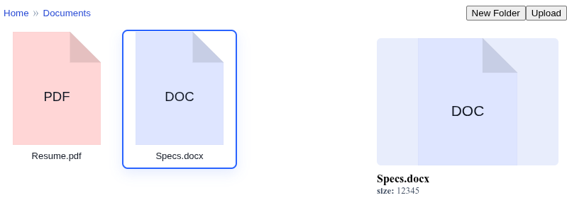

# Browse.js
## A lightweight yet versatile file browser written in vanilla JavaScript.

## Usage

Install:

```shell
npm i browse.js
```

Import in your application:

```javascript
import {BrowseJS} from 'browse.js';
```

Alternatively, take advantage of a CDN:
```javascript
import {BrowseJS} from 'https://cdn.jsdelivr.net/npm/browse.js@latest';
```

## Example

Open `demo/index.html` in a browser (for example, using `python -m http.server 8000`) to run a demo.



© 2026 Daniel Foerster. All rights reserved. Made available under the Apache 2.0 license; see [LICENSE](./LICENSE) for details.
